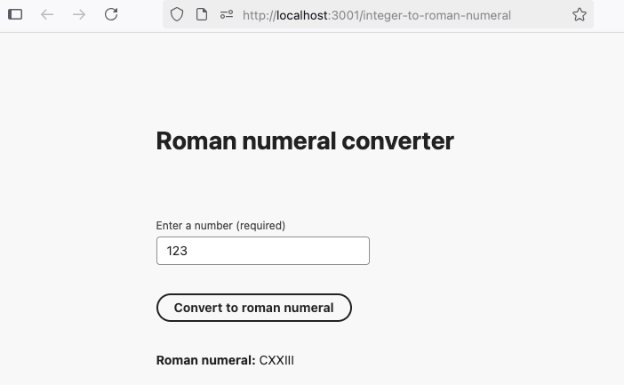
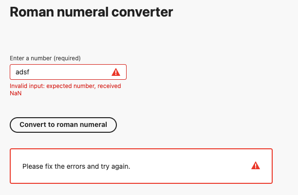

# Roman Numeral Project Setup
This repo provides a high level solution overview for the Roman numeral conversion coding assessment.

It also houses convenience make commands that facilitate:
- cloning the [roman-numeral-service](https://github.com/jasonmcaffee/roman-numeral-service)
- cloning the [roman-numeral-ui](https://github.com/jasonmcaffee/roman-numeral-ui)
- using docker compose to start the full stack:
    - datadog-agent - used for sending logs, traces, metrics to datadog
    - roman-numeral-service - roman numeral backend service
    - roman-numeral-ui - roman numeral react ui

## Environment Requirements
### Make (optional)
This is used mainly for convenience commands, so isn't a hard requirement.
```shell
xcode-select --install
```

### Docker Desktop
Allows for docker builds, docker compose, etc. 

Download manually [here](https://www.docker.com/products/docker-desktop/) or install via brew
```shell
brew install --cask docker
```

## Setup
To clone, build, and run the entire stack, run the following command, (optionally) passing in your DD_API_KEY.

Any value will work, but only a valid key will result in metrics, logs, and traces showing up in DataDog.
```shell
DD_API_KEY=1234 make clone-build-run-roman-numeral-stack
```

Or alternatively you can run the stack without using make:
```shell
git clone https://github.com/jasonmcaffee/roman-numeral-service.git
git clone https://github.com/jasonmcaffee/roman-numeral-ui.git
docker-compose --profile monitoring up -d --build
open http://localhost:3001/integer-to-roman-numeral
```

This will result in the service, ui, and dd-agent being started, and the main page being opened in your browser:


Note: I intentionally use the Spectrum TextField, rather than NumberField, as to allow for validation error messaging from the service to be demonstrated:


## Teardown 
To stop the service:
```shell
make stop
```

# High Level Overview

For this assessment, which asked to treat this as any other project for my employer, I created frontend and backend applications, in separate projects.

- Frontend app - Next.js was used for the frontend app, as it does well with serving SSR and CSR react web applications.  See the project readme for further details.
- Backend service - Nest.js was used for the backend service, as it provides core functionality which facilitates service, controller, and model creation via declarative annotations, and provides useful mechanisms such as dependency injection, middleware, etc. See the project readme for further details.

Having separate apps allows us to clearly separate our concerns, as well as allow for reusability, and independent scaling and deployments.

## Docker Compose
I use docker compose to manage orchestrating the 2 app containers and datadog container.  This helps consolidate service orchestration and configuration, allowing the entire stack to be brought up with a single command.

## Roman Numeral Conversion Solution
I referenced the wiki for [Roman Numeral Conversion](https://en.wikipedia.org/wiki/Roman_numerals) to research the logic needed for integer to Roman numeral conversion, then implemented my own custom solution. 

I found that converting integers in range 1-3999 can be accomplished by:
- First breaking the number into decimal/place values.  e.g. 123 is 1 hundreds, 2 tens, 3 units.
  - I accomplish this with some simple division, flooring, and modulus operations.
- Next I find the roman numeral equivalent for each decimal/place value.
  - I accomplish this by having a separate array of values for each decimal/place value, then using the place value as an index to find the corresponding Roman numeral value.
- Finally, I combine the Roman numerals from each place value into a single string, and return the result

See the [service code](https://github.com/jasonmcaffee/roman-numeral-service/blob/b22da74454730e792b4a9ad666bb63d15ec39710/src/services/romanNumeral.service.ts#L14-L14) for more details.

## Observability
Datadog is used for metrics, logs, and traces.  See projects for screenshots and further details.

## Automated Testing
I am an advocate of writing both integration and unit tests.  

### Backend Service
The backend service uses integration and unit tests to ensure the correctness of the convert integer to roman numeral functionality.

For the integration tests, I use a generated client, and require that the service be running so that we can validate its actual behavior, as close as it would be to when running in production.

### Frontend App
The frontend app tests following paradigms and libraries used in the react spectrum library, including using simulated user interactions and component rendering checks to test desired functionality.
